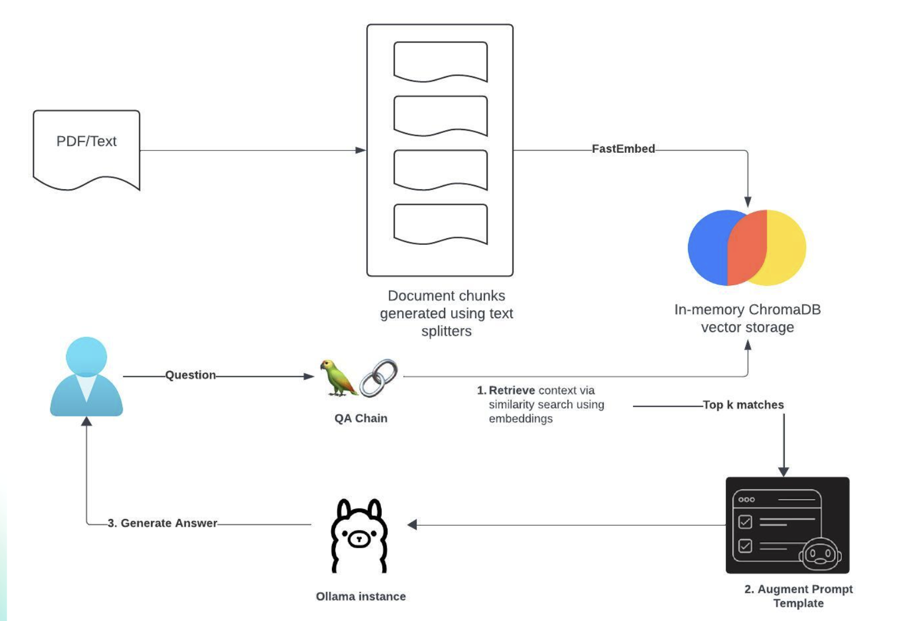

## Grace Hopper AI Chatbot application

### Pre-requisites start here

### Pre-requisite 1: Install the Dependencies:

- langchain
- langchain_community
- streamlit - used for building POCs/prototypes [About Streamlit](https://docs.streamlit.io/get-started)
- streamlit-chat [Streamlit-chat Installation](https://pypi.org/project/streamlit-chat/)
- pypdf
- chromadb
- fastembed

```bash
pip3 install langchain langchain_community streamlit streamlit_chat chromadb pypdf fastembed
```

### Pre-requisite 2:Set up Ollama

We need a LLM server which we can easily setup locally and do not have to worry about API keys!

To do this, download Ollama from https://ollama.com/
Ollama can be setup locally and provides multiple models: https://ollama.com/library

We can run a compact model - Mistral-7B

```
ollama pull mistral
```

### Pre-requisites end here

### Excercise execution

#### Architecture diagram
<div> 
    
</div>
<br/>

#### Building RAG chat-bot

We will build a RAG-based chat application which will answer questions based on PDF document you will upload.
We will use Langchain, [Ollama](https://ollama.com/) and Streamlit UI

#### Let's build the RAG pipeline

The RAG pipeline is divided into the following steps which will be achieved from the following file

```
rag_pipeline.py
```

### Step 1: Initiatlize Mistral model

Update the **init**() method - initialize Mistral using this API
https://api.python.langchain.com/en/latest/chat_models/langchain_community.chat_models.ollama.ChatOllama.html

```
    self.model = ChatOllama(model="mistral")
```

### Step 2: Split the uploaded document into smaller chunks using [text splitters](https://python.langchain.com/v0.1/docs/modules/data_connection/document_transformers/)

- Here, we are using the [RecursiveCharacterTextSplitter](https://python.langchain.com/v0.1/docs/modules/data_connection/document_transformers/recursive_text_splitter/)

Add the following code in the method processDocument()

```
    self.text_splitter = RecursiveCharacterTextSplitter(chunk_size=200, chunk_overlap=20)
    document_chunks = self.text_splitter.split_documents(docs)
```

### Step 3: Vectorize the document chunks using [FastEmeddings](https://github.com/qdrant/fastembed) and store in [Chroma](https://github.com/chroma-core/chroma)

```
    chroma_vector_store = Chroma.from_documents(documents=document_chunks, embedding=FastEmbedEmbeddings())
```

#### Step 4: Configure the Vector store [Retriever](https://python.langchain.com/v0.1/docs/modules/data_connection/retrievers/vectorstore/) for the type of search

```
    self.retriever = chroma_vector_store.as_retriever(
            search_type="similarity_score_threshold",
            search_kwargs={
                "k": 10, ## return top k chunks
                "score_threshold": 0.50, ## with scores above this value
            },
        )
```

#### Step 5: Add a system prompt template using Langchain [Prompts](https://python.langchain.com/v0.1/docs/modules/model_io/prompts/)

```
    self.prompt_from_template = PromptTemplate.from_template(
            """
            <s> [INST] You are an assistant for question-answering tasks. Use the following pieces of retrieved context
            to answer the question. If you don't know the answer, just say that you don't know. Answer only as per what is mentioned in the document.
            Use three sentences
             maximum and keep the answer concise. [/INST] </s>
            [INST] Question: {question}
            Context: {context}
            Answer: [/INST]
            """
        )
```

#### Step 6: Build a langchain conversion chain using prompt template and model with an output parser using [LCEL](https://python.langchain.com/v0.1/docs/expression_language/get_started/)

```
    self.chain = ({"context": self.retriever, "question": RunnablePassthrough()}
                      | self.prompt_from_template
                      | self.model
                      | StrOutputParser())
```

#### StreamLit UI

Use StreamLit APIs to demonstrate the chatbot

[Streamlit Installation](https://pypi.org/project/streamlit-chat/)
[About Streamlit](https://docs.streamlit.io/get-started)

```
chat_ui.py
```

#### How to run this StreamLit app?

Start Ollama

set OLLAMA_HOST=127.0.0.1:11435

ollama serve

<div> 
    
</div>
<br/>

Execute

```
streamlit run chat_ui.py
```

Use the pdf file - Lumina.pdf (or Elena.pdf) in the folder and Ask questions about Lumina, the startup (or Elena)

#### Final output
<div> 
    
</div>
<br/>


#### Key Points

**What is LagChain?**
LangChain is a powerful framework designed for building applications that work with large language models (LLMs) in a structured, flexible, and efficient way. 
It provides tools, components, and abstractions to help developers create applications that use LLMs not just for simple text generation, but for more complex, interactive, and useful applications like chatbots, virtual assistants, document retrieval systems, and data analysis tools.

**Key Features of LangChain**

**Chains:**
LangChain allows developers to link together sequences of actions, or "chains," that combine multiple steps involving LLMs.
For example, a chain might retrieve a document, summarize it using an LLM, then answer a specific user question based on the summary.

**Retrieval-Augmented Generation (RAG):**
One of the strengths of LangChain is its support for Retrieval-Augmented Generation. 
LangChain simplifies the process of retrieving relevant documents and feeding them into an LLM to generate more accurate and context-rich responses.

**Memory Management:**
LangChain has memory components that let applications remember previous interactions. 
This is useful in chatbots or assistants where retaining context over multiple turns is essential.

**Agents and Tools:**
LangChain lets you create "agents" that can use various "tools" (external functions, APIs, and data sources) to respond to user queries. 
For example, an agent can use a calculator tool to perform mathematical operations or connect to a knowledge base to fetch information.

**Support for Knowledge Bases and Vector Stores:**
LangChain can connect to vector databases (like Pinecone or FAISS) to store and retrieve information efficiently.
This makes it ideal for applications that need to search through large sets of documents or data quickly.

**Customizable and Extensible:**
Developers can customize and extend LangChain’s components to fit their specific use case, adding new tools, adjusting chain logic, or tweaking memory parameters.

**Example Use Cases**
**Chatbots with Contextual Memory:** A chatbot that remembers details from previous conversations and provides more relevant responses over time.
**Document-Based Q&A:** A customer support tool that pulls information from a company’s document repository to answer user questions accurately.
**Data Summarization and Analysis:** An application that retrieves documents, summarizes them, and answers specific questions, especially in fields like legal, finance, or research.

**Why LangChain?**
LangChain makes it easier to build applications that use LLMs in more complex ways than simple text generation. 
It provides structure, modularity, and components tailored to handle real-world, interactive applications.

**What is langchain_community.vectorstores.Chroma?**

langchain_community.vectorstores.Chroma is a specialized module within the LangChain framework that facilitates integration with Chroma, a popular open-source vector database used to store, search, and retrieve high-dimensional embeddings. 
In the context of LangChain, Chroma acts as a vector store where you can efficiently manage embeddings for text, images, or other data types, enabling fast and accurate information retrieval in applications.

**Key Aspects of langchain_community.vectorstores.Chroma**

**Vector Storage and Retrieval:**

Chroma stores vector embeddings, which represent text or other data in high-dimensional space, enabling similarity-based searches. 
LangChain uses this to retrieve the most relevant pieces of information based on user queries.

**Integration with Large Language Models (LLMs):**

Within LangChain, Chroma works seamlessly with LLMs to support Retrieval-Augmented Generation (RAG). 
When a query is received, the system retrieves relevant documents from Chroma using vector-based similarity and feeds this information to the LLM to generate more contextually accurate responses.

**Embedding and Document Management:**

langchain_community.vectorstores.Chroma allows for easy storage, updating, and deletion of embeddings, making it possible to manage large document collections efficiently. 
The embeddings are typically created from textual content and stored in Chroma to be quickly searched when needed.

**Fast Similarity Search:**

Since Chroma is optimized for similarity search, LangChain can rapidly retrieve the top-n most relevant documents or text snippets, which is crucial in applications where response time is essential, such as real-time chatbots or interactive applications.

**Example Workflow Using langchain_community.vectorstores.Chroma**

**Data Ingestion:**
Load documents or text data and convert each one into a vector embedding using a model like OpenAI’s GPT or Sentence Transformers.

**Embedding Storage:**
Store the generated embeddings in the Chroma vector store via langchain_community.vectorstores.Chroma.

**Query and Retrieval:**
When a user poses a query, it is converted into an embedding, and Chroma retrieves the closest matching documents by comparing vector similarities.

**Response Generation:**
The retrieved documents are fed to an LLM (e.g., GPT-4), which uses them to generate a relevant and accurate response.

**Benefits of Using langchain_community.vectorstores.Chroma**

**Scalability:** Chroma is designed for high-dimensional data, making it suitable for handling large-scale applications.
**Speed:** Vector-based retrieval enables fast searches, making it ideal for real-time or near-real-time applications.
**Ease of Integration:** As part of LangChain, Chroma can be used with other LangChain components like memory, agents, and chains.

In summary, langchain_community.vectorstores.Chroma is a powerful vector storage tool within LangChain that enables efficient, scalable, and fast document retrieval, especially useful for applications like chatbots, search engines, and any tool that relies on high-dimensional similarity search.

**What is FastEmbedEmbeddings?**

FastEmbedEmbeddings is a utility within the LangChain framework designed to quickly generate embeddings for text data. 
Embeddings are numerical representations of text (or other data) in high-dimensional space, which are crucial for similarity search, clustering, and machine learning tasks involving natural language.
In the LangChain ecosystem, FastEmbedEmbeddings can be used to streamline the process of creating these embeddings, especially when working with vector stores like Chroma.

**Key Aspects of FastEmbedEmbeddings**

**High-Speed Embedding Generation:**
FastEmbedEmbeddings is optimized for generating embeddings quickly, which is essential for applications that need to process large volumes of text or require real-time embedding generation.

**Scalability:**
It’s well-suited for large-scale applications because it can handle embedding generation efficiently. 
This is especially useful when dealing with extensive datasets or when embedding must be generated frequently (e.g., dynamic content in real-time chatbots).

**Compatibility with Vector Stores:**
The embeddings created by FastEmbedEmbeddings can be seamlessly stored in vector stores like Chroma or Pinecone, allowing for efficient retrieval and similarity search in applications.

**Enhanced Performance in Retrieval-Augmented Generation (RAG):**
In RAG setups, FastEmbedEmbeddings allows for fast embedding generation, which is then used to retrieve the most relevant documents or data points. 
This improves the speed and accuracy of the responses generated by the language model.

**Example Use Case of FastEmbedEmbeddings**
Let’s say you’re building a chatbot that needs to answer questions based on a large set of documents stored in a vector database like Chroma. 
Here’s how FastEmbedEmbeddings fits into the process:

**Data Preparation:**
You load a set of documents that need to be embedded for similarity search.
**Embedding Generation:**
Use FastEmbedEmbeddings to quickly generate embeddings for each document, which will be stored in Chroma.
**Query Processing:**
When a user asks a question, the question is embedded using FastEmbedEmbeddings, and the vector store retrieves similar documents based on vector similarity.
**Answer Generation:**
The retrieved documents are fed into an LLM, which generates a contextually accurate answer based on the content.

**Benefits of FastEmbedEmbeddings**
**Efficiency:** Optimized for speed, enabling faster processing of large datasets.
**Real-Time Capability:** Suitable for applications needing quick responses, such as customer support or real-time search.
**Seamless Integration:** Works well with LangChain’s RAG flow and vector storage, allowing for easy deployment in LLM-based applications.

In essence, FastEmbedEmbeddings is a high-speed, efficient way to generate embeddings, especially useful in applications that require large-scale, real-time, or frequent embedding operations.


